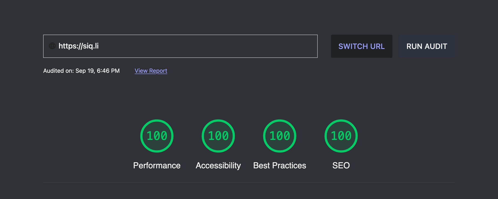

# Siqli

- Simple homepage.
- Short URL generator
- URL Redirector

## Performance

As one might expect from a very simple page served by a Cloudflare Worker, this quick. 

As measured by https://web.dev/measure.

## `package.json`

### `homepage`

This is used for the copy to clipboard function of `links/add.js`

### `config`

Configuration in this is used for `links/add.js`. Configure per requirements.

### `optionalDependencies`

- `serve`: handy for testing the HTML pages without needing to run the worker.
- `wrangler`: in case it isn't installed globally.

Use `npm install --omit=optional` to skip.

## Private Links Page

Set a `LINKS_PAGE` environment variable in the `wrangler.toml`, Cloudflare UI, or Wrangler CLI.

Set the `routes` for the worker in the `wrangler.toml`.

## Add Redirect URL

Run `node links/add [URL]` or `node links/add [URL] [CODE]`. This adds a new key/value to `links/link-list.json`. Disable a link *(without removing it)* by appending a `!` to the beginning of the key. These values are skipped when `links/filter-links.js` builds `redirects.json` for the worker.

## Home/404 Pages

Basic HTML pages. HTML-minifier used prior to inclusion in the worker.

## License

[Jam License](LICENSE)
